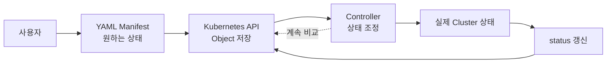
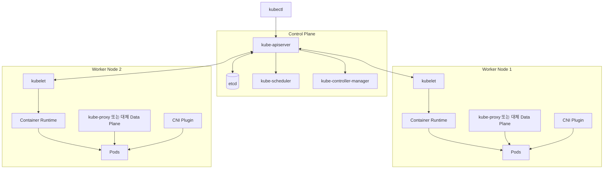
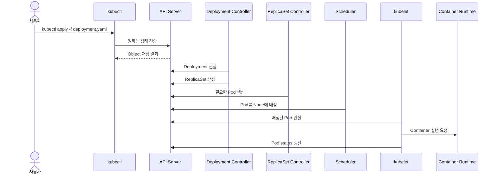

# 1. 쿠버네티스 리소스와 클러스터 구조

쿠버네티스는 컨테이너 실행 명령을 여러 서버에 전달하는 도구에 그치지 않는다. 사용자가 원하는 상태를 Kubernetes API에 오브젝트로 저장하면 여러 컨트롤러가 현재 상태를 계속 관찰하고 원하는 상태에 맞춘다.

```text
원하는 상태: web Pod를 항상 3개 실행한다.
현재 상태:   web Pod가 2개만 실행 중이다.
조정 결과:   컨트롤러가 Pod 1개를 새로 만든다.
```

이처럼 원하는 상태와 현재 상태의 차이를 줄이는 반복 동작을 reconciliation이라고 한다.

## 모든 리소스는 오브젝트로 관리한다

Pod, Deployment, Service, ConfigMap과 Namespace는 모두 Kubernetes API가 관리하는 오브젝트이다. 오브젝트에는 크게 다음 정보가 담긴다.

- 사용자가 원하는 상태인 `spec`
- Kubernetes가 관찰한 현재 상태인 `status`
- 이름, namespace, label 같은 식별 정보인 `metadata`

사용자는 일반적으로 `spec`을 작성한다. `status`는 kubelet과 controller 같은 구성 요소가 관찰 결과를 바탕으로 갱신하므로 직접 원하는 값으로 관리하지 않는다.



컨테이너가 종료되거나 node가 사라져도 컨트롤러는 저장된 오브젝트를 기준으로 다시 조정할 수 있다. 이 선언적 상태 관리가 단일 Docker 컨테이너 실행과 구별되는 핵심이다.

## YAML Manifest의 기본 구조

Kubernetes 오브젝트를 만드는 YAML에는 다음 네 필드가 기본적으로 필요하다.

| 필드 | 의미 | 예시 |
| --- | --- | --- |
| `apiVersion` | 사용할 Kubernetes API의 group과 version | `v1`, `apps/v1` |
| `kind` | 생성할 오브젝트의 종류 | `Pod`, `Deployment` |
| `metadata` | 이름, namespace, label 등 식별 정보 | `name: web` |
| `spec` | 사용자가 원하는 상태 | container image, replicas |

간단한 Pod Manifest는 다음과 같다.

```yaml
apiVersion: v1
kind: Pod
metadata:
  name: web
  labels:
    app: web
spec:
  containers:
    - name: nginx
      image: nginx:1.27
      ports:
        - containerPort: 80
```

`spec` 내부 구조는 `kind`마다 다르다. 예를 들어 Pod는 `containers`를 정의하지만 Service는 `selector`와 `ports`를 정의한다. 정확한 필드는 사용하는 Kubernetes version의 API Reference에서 확인한다.

### metadata와 Label

`metadata.name`은 같은 namespace 안에서 오브젝트를 구별한다. Label은 오브젝트에 붙이는 key-value 정보이며 ReplicaSet과 Service가 관리할 Pod를 선택할 때 사용한다.

```yaml
metadata:
  name: web
  namespace: default
  labels:
    app: web
    tier: frontend
```

Label은 단순 설명이 아니라 오브젝트 연결에 사용되는 계약이다. Selector와 label이 다르면 ReplicaSet이 Pod를 관리하지 못하거나 Service에 endpoint가 생기지 않는다.

## 명령형과 선언형 관리

쿠버네티스 오브젝트는 명령어만으로도 만들 수 있다.

```bash
kubectl run web --image=nginx:1.27
```

이 방식은 빠른 확인과 일회성 실습에는 편리하지만, 어떤 옵션으로 만들었는지 명령 기록에 의존한다. 여러 사람이 같은 환경을 재현하거나 변경을 검토하기 어렵다.

선언형 방식은 원하는 상태를 YAML 파일에 기록하고 적용한다.

```bash
kubectl apply -f web-pod.yaml
```

| 구분 | 명령형 | 선언형 YAML |
| --- | --- | --- |
| 중심 | 수행할 동작 | 도달해야 할 상태 |
| 재현성 | 실행 기록에 의존 | 같은 파일을 다시 적용 가능 |
| 변경 검토 | 명령 간 차이를 보기 어려움 | Git diff로 확인 가능 |
| 적합한 용도 | 빠른 실험, 조회, 디버깅 | 반복 배포, 운영, 협업 |

학습 중에는 두 방식을 모두 사용하지만 리소스 정의는 YAML로 남기는 것을 기본 원칙으로 한다. `kubectl get`, `describe`, `logs`처럼 상태를 조회하는 명령은 계속 사용한다.

## 쿠버네티스 클러스터 구성 요소

과거에는 control plane node를 master node라고 부르기도 했지만 현재 문서에서는 control plane이라는 용어를 사용한다.



### Control Plane 구성 요소

| 구성 요소 | 역할 |
| --- | --- |
| `kube-apiserver` | 모든 API 요청의 진입점. 인증, 인가, admission과 API 검증 수행 |
| `etcd` | Kubernetes 오브젝트와 클러스터 상태를 저장하는 분산 key-value 저장소 |
| `kube-scheduler` | 아직 node가 정해지지 않은 Pod를 조건에 맞는 node에 배치 |
| `kube-controller-manager` | ReplicaSet, node 등 여러 controller loop 실행 |
| `cloud-controller-manager` | 사용하는 환경에 따라 cloud의 node, route, Load Balancer와 연동 |

CoreDNS는 클러스터 내부 DNS를 제공하는 중요 add-on이지만 API Server나 Scheduler처럼 control plane 자체의 필수 구성 요소로 분류하지는 않는다. 일반적으로 Deployment 형태의 Pod로 실행된다.

### Node 구성 요소

| 구성 요소 | 역할 |
| --- | --- |
| `kubelet` | node에 배정된 Pod를 확인하고 container runtime을 통해 실행 상태 유지 |
| Container Runtime | container image를 받고 container 실행. 대표적으로 containerd, CRI-O |
| `kube-proxy` | Service의 가상 IP와 backend Pod로 향하는 트래픽 규칙 구성 |
| CNI Plugin | Pod network interface, IP, node 간 Pod 통신 구성 |

Control plane node도 하나의 node이므로 kubelet과 runtime을 실행할 수 있다. 다만 production에서는 taint를 두어 일반 workload가 배치되지 않게 하는 경우가 많다. 또한 Cilium 같은 구현은 eBPF data plane으로 kube-proxy를 대체할 수 있으므로 모든 클러스터가 반드시 kube-proxy process를 사용하는 것은 아니다.

## YAML이 실제 상태가 되는 과정

Deployment YAML을 적용하는 흐름을 단순화하면 다음과 같다.



`kubectl`이 worker node에 직접 접속해 container를 실행하는 것이 아니다. API Server에 원하는 상태를 제출하고 각 구성 요소가 자신의 책임에 따라 비동기적으로 처리한다.

## 기본 확인 명령

```bash
kubectl apply -f web-pod.yaml
kubectl get pods
kubectl get pod web -o yaml
kubectl describe pod web
kubectl delete -f web-pod.yaml
```

`kubectl apply`가 성공했다는 것은 API가 오브젝트를 받아들였다는 뜻이다. 실제 container가 준비되었는지는 `kubectl get`의 상태와 `kubectl describe`의 Conditions, Events를 함께 확인해야 한다.

## 참고

- [Kubernetes Objects](https://kubernetes.io/docs/concepts/overview/working-with-objects/)
- [Kubernetes Components](https://kubernetes.io/docs/concepts/overview/components/)
- [Declarative Management](https://kubernetes.io/docs/tasks/manage-kubernetes-objects/declarative-config/)
- [Labels and Selectors](https://kubernetes.io/docs/concepts/overview/working-with-objects/labels/)
