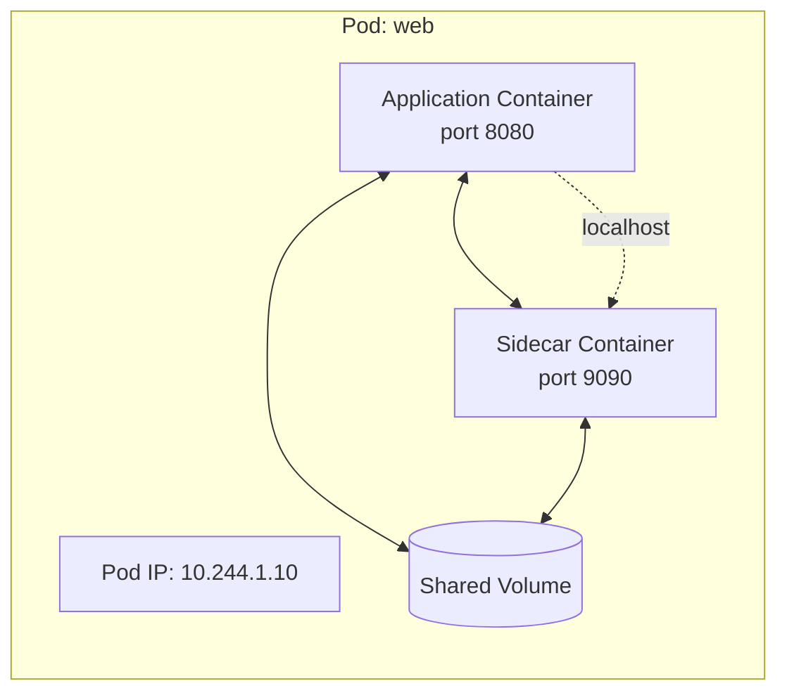
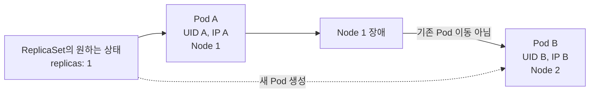
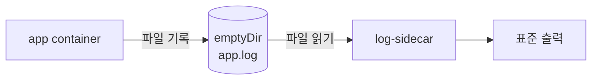

# 2. Pod: 컨테이너를 다루는 기본 단위

Pod는 쿠버네티스에서 생성하고 배포할 수 있는 가장 작은 실행 단위이다. Pod 하나에는 한 개 이상의 container가 들어가며 같은 Pod의 container는 network namespace와 volume을 공유하고 항상 같은 node에 함께 배치된다.



같은 Pod의 container는 동일한 Pod IP를 사용하고 서로 `localhost`로 통신한다. 따라서 각 container가 같은 port를 동시에 사용할 수는 없다.

## Pod YAML 구조

```yaml
apiVersion: v1
kind: Pod
metadata:
  name: web
  labels:
    app: web
spec:
  containers:
    - name: nginx
      image: nginx:1.27
      ports:
        - name: http
          containerPort: 80
```

### apiVersion

Pod는 Kubernetes core API group에 포함되므로 `apiVersion: v1`을 사용한다. `apps/v1`을 사용하는 Deployment나 ReplicaSet과 구분한다.

### kind

만들 오브젝트 종류를 `Pod`로 지정한다. 대소문자를 구분하므로 `pod`가 아니라 `Pod`로 작성한다.

### metadata

`name`으로 Pod를 식별하고 `labels`로 논리적인 분류 정보를 붙인다. 이후 ReplicaSet과 Service는 Pod 이름이 아니라 label selector로 Pod를 찾는다.

### spec

Pod에서 실행할 container 목록과 image, command, port, volume, restart policy 등을 정의한다. `containers`는 배열이므로 각 항목에 고유한 `name`이 필요하다.

`containerPort`는 container가 사용하는 port를 설명하는 metadata에 가깝다. 이 필드를 적는 것만으로 클러스터 내부나 외부에 port가 노출되지는 않는다. 안정적인 접근 경로는 Service로 만든다.

## Pod 사용하기

Manifest를 저장하고 적용한다.

```bash
kubectl apply -f web-pod.yaml
```

Pod가 만들어지는 과정을 관찰할 수 있다.

```bash
kubectl get pods --watch
```

일반적인 변화는 다음과 같다.

```text
Pending -> ContainerCreating -> Running
```

`Running`은 Pod가 node에 배치되고 모든 container가 생성되었으며 적어도 하나가 실행 중이라는 phase이다. 애플리케이션이 실제 요청을 받을 준비가 되었다는 뜻과 완전히 같지는 않다. 서비스 트래픽 수신 여부는 readiness probe와 Ready condition이 결정한다.

## Pod를 확인하는 명령어

### kubectl get

리소스 목록과 요약 상태를 조회한다.

```bash
kubectl get pods
kubectl get pod web -o wide
kubectl get pod web -o yaml
kubectl get pods -l app=web
```

- `-o wide`: Pod IP, 배치된 node 등 추가 정보 표시
- `-o yaml`: API에 저장된 `spec`과 현재 `status` 확인
- `-l`: label selector로 대상 필터링

### kubectl describe

한 리소스의 설정과 상태를 사람이 읽기 쉬운 형태로 확인한다.

```bash
kubectl describe pod web
```

문제가 생기면 다음 항목을 우선 확인한다.

- `State`, `Last State`, `Reason`, `Exit Code`
- `Ready`, `Restart Count`
- `Conditions`
- 마지막 `Events`

`ImagePullBackOff`, `CrashLoopBackOff`, scheduling 실패 같은 원인은 대부분 Events와 container state에서 단서를 찾을 수 있다.

### kubectl logs

container가 표준 출력과 표준 오류로 남긴 로그를 확인한다.

```bash
kubectl logs web
kubectl logs web --follow
kubectl logs web --previous
kubectl logs web -c nginx
```

- `--follow`: 새 로그를 계속 출력
- `--previous`: 재시작되기 전 container의 로그 확인
- `-c`: 여러 container 중 하나를 지정

애플리케이션이 파일에만 로그를 남기면 `kubectl logs`에서 볼 수 없다. 기본적으로 container log는 표준 출력으로 보내는 것이 좋다.

### kubectl exec

실행 중인 container 안에서 명령을 실행한다.

```bash
kubectl exec web -- nginx -v
kubectl exec -it web -- /bin/sh
kubectl exec -it web -c nginx -- /bin/sh
```

`--` 앞은 kubectl 옵션이고 뒤는 container 안에서 실행할 명령이다. Image에 `bash`가 없을 수 있으므로 최소 image에서는 `/bin/sh`를 먼저 시도한다.

## Pod와 Docker 컨테이너의 차이

| 구분 | Docker Container | Kubernetes Pod |
| --- | --- | --- |
| 의미 | 격리된 process 실행 단위 | 한 logical host로 함께 배치되는 container 집합 |
| container 수 | 하나 | 하나 이상 |
| IP | container network 설정에 따라 부여 | Pod 단위로 부여하고 내부 container가 공유 |
| storage 공유 | volume option으로 구성 | Pod의 volume을 여러 container에 mount |
| scheduling | 단일 Docker host 중심 | scheduler가 cluster node를 선택 |
| 복구 주체 | Docker restart policy 등 | kubelet과 상위 workload controller |

대부분의 Pod에는 주 애플리케이션 container 하나만 둔다. 단순히 여러 container를 함께 배포하고 싶다는 이유만으로 하나의 Pod에 합치지 않는다. 생명주기와 자원, network namespace를 반드시 함께 가져야 하는 container만 같은 Pod에 둔다.

## Pod의 생명주기와 일회성

Pod는 실행 위치와 identity가 영구적으로 유지되는 VM이 아니다. Pod에는 고유 UID가 있고 한번 node에 배치된 Pod 자체가 다른 node로 이동하지 않는다.



같은 Pod 안에서 container process만 실패하면 kubelet이 `restartPolicy`에 따라 container를 재시작할 수 있다. 그러나 node 장애나 Pod 삭제로 기존 Pod를 사용할 수 없으면 ReplicaSet 같은 controller가 새로운 UID와 IP를 가진 대체 Pod를 만든다.

따라서 일반 애플리케이션은 Pod를 직접 하나만 만들기보다 Deployment로 관리한다. 데이터도 Pod 로컬 filesystem에만 의존하지 않고 필요한 경우 PersistentVolume이나 외부 저장소를 사용한다.

## 완전한 애플리케이션 단위와 Sidecar

Pod는 container 하나가 아니라 함께 동작해야 하는 애플리케이션 구성 요소의 경계를 표현한다. 대표적인 multi-container pattern이 sidecar이다.

다음 예시는 application container가 공유 volume에 로그를 쓰고 sidecar가 그 파일을 읽어 표준 출력으로 전달한다.

```yaml
apiVersion: v1
kind: Pod
metadata:
  name: sidecar-example
  labels:
    app: sidecar-example
spec:
  volumes:
    - name: logs
      emptyDir: {}
  containers:
    - name: app
      image: busybox:1.36
      command:
        - /bin/sh
        - -c
        - while true; do date >> /var/log/app.log; sleep 5; done
      volumeMounts:
        - name: logs
          mountPath: /var/log
    - name: log-sidecar
      image: busybox:1.36
      command:
        - /bin/sh
        - -c
        - tail -n+1 -F /var/log/app.log
      volumeMounts:
        - name: logs
          mountPath: /var/log
```



두 container는 같은 Pod로 함께 생성·삭제되고 같은 node에서 volume을 공유한다. 이것이 sidecar가 적절한 이유이다. 반대로 frontend와 database처럼 독립적으로 확장하고 배포해야 하는 component는 서로 다른 Pod로 분리한다.

확인과 정리:

```bash
kubectl apply -f sidecar-pod.yaml
kubectl logs sidecar-example -c log-sidecar --follow
kubectl delete -f sidecar-pod.yaml
```

## 참고

- [Pods](https://kubernetes.io/docs/concepts/workloads/pods/)
- [Pod Lifecycle](https://kubernetes.io/docs/concepts/workloads/pods/pod-lifecycle/)
- [Sidecar Containers](https://kubernetes.io/docs/concepts/workloads/pods/sidecar-containers/)
- [Debug Running Pods](https://kubernetes.io/docs/tasks/debug/debug-application/debug-running-pod/)
