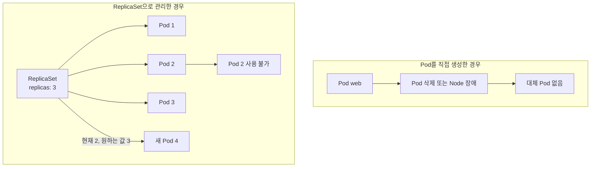
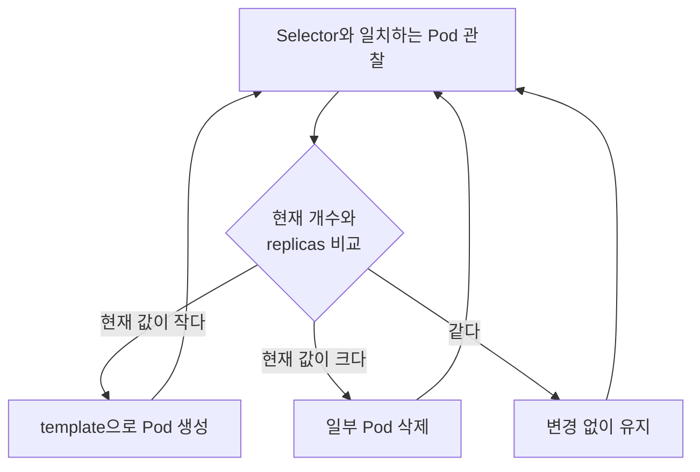
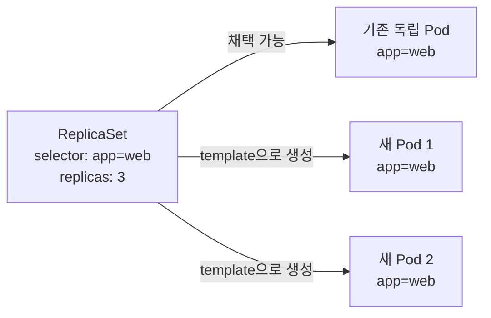

# 3. ReplicaSet: 일정 개수의 Pod 유지

ReplicaSet은 label selector와 일치하는 Pod가 지정한 개수만큼 실행되도록 유지하는 controller이다. 실행 중인 개수가 원하는 개수보다 적으면 Pod를 만들고, 많으면 일부를 삭제한다.

ReplicaSet의 목적은 특정 이름의 Pod를 되살리는 것이 아니라 조건에 맞는 Pod의 개수를 유지하는 것이다.

## ReplicaSet이 필요한 이유

Pod를 직접 생성하면 API Server에는 Pod 하나를 실행하고 싶다는 정보만 저장된다. 그 Pod가 삭제되었을 때 동일한 역할의 새 Pod를 만들어야 한다는 상위 목표는 없다.



### Pod lifecycle 관점

- 같은 Pod 안의 container process가 실패하면 kubelet이 container를 재시작할 수 있다.
- Pod가 삭제되거나 node 장애로 사라지면 그 Pod 자체가 다른 node로 이동하지는 않는다.
- ReplicaSet은 감소한 개수를 발견하고 Pod template으로 새로운 Pod를 생성한다.
- 새 Pod는 기존 Pod와 역할은 같지만 UID, 이름과 IP가 다른 별도 오브젝트이다.

따라서 애플리케이션은 특정 Pod 이름이나 IP에 의존해서는 안 된다. Service가 변화하는 Pod 집합 앞에서 안정적인 접근점을 제공한다.

## ReplicaSet YAML 구조

ReplicaSet의 핵심은 `replicas`, `selector`, `template`이다.

```yaml
apiVersion: apps/v1
kind: ReplicaSet
metadata:
  name: web-rs
spec:
  replicas: 3
  selector:
    matchLabels:
      app: web
  template:
    metadata:
      labels:
        app: web
    spec:
      containers:
        - name: nginx
          image: nginx:1.27
          ports:
            - containerPort: 80
```

### spec.replicas

동시에 유지할 Pod 개수이다. 값을 생략하면 기본값은 1이다.

```yaml
spec:
  replicas: 3
```

실행 중인 대상 Pod가 2개이면 1개를 만들고 4개이면 1개를 삭제해 3개에 맞춘다.

### spec.selector

ReplicaSet이 어떤 Pod를 자신의 관리 대상으로 판단할지 정의하는 label selector이다.

```yaml
spec:
  selector:
    matchLabels:
      app: web
```

`metadata.labels`가 아니라 `spec.selector`가 관리 대상을 결정한다. ReplicaSet 자체의 label과 Pod selector는 서로 다른 목적을 가진다.

### spec.template

Pod가 부족할 때 새 Pod를 만들기 위한 설계도이다. `template` 내부는 `apiVersion`과 `kind`를 제외한 Pod Manifest와 같은 구조이다.

```yaml
spec:
  template:
    metadata:
      labels:
        app: web
    spec:
      containers:
        - name: nginx
          image: nginx:1.27
```

`spec.template.metadata.labels`는 반드시 ReplicaSet의 `spec.selector`와 일치해야 한다. 일치하지 않으면 API Server가 오브젝트 생성을 거부한다.

## ReplicaSet 사용하기

```bash
kubectl apply -f web-replicaset.yaml
kubectl get replicasets
kubectl get rs web-rs
kubectl get pods -l app=web
kubectl describe rs web-rs
```

`kubectl get rs`에서 다음 값의 관계를 본다.

| 열 | 의미 |
| --- | --- |
| `DESIRED` | `spec.replicas`에 정의한 개수 |
| `CURRENT` | ReplicaSet이 현재 관리하는 Pod 개수 |
| `READY` | Ready 상태인 Pod 개수 |

복구 동작을 이해하려면 관리 중인 Pod 하나를 삭제하고 상태 변화를 관찰할 수 있다.

```bash
kubectl get pods -l app=web
kubectl delete pod <POD_NAME>
kubectl get pods -l app=web --watch
```

삭제한 Pod가 돌아오는 것이 아니라 다른 이름과 UID를 가진 새 Pod가 생성된다.

## ReplicaSet의 동작 원리

ReplicaSet controller는 대략 다음 reconciliation loop를 반복한다.



이 과정은 일회성 명령이 아니라 지속적인 제어 루프이다. 사용자가 Pod를 삭제하든 node 장애로 Pod가 사라지든 관찰 결과가 원하는 개수보다 작아지면 같은 조정이 일어난다.

## 느슨한 연결과 Label Selector

ReplicaSet과 Pod는 이름으로 직접 묶이지 않는다. ReplicaSet은 selector와 일치하는 Pod를 찾고 `ownerReferences`를 통해 소유 관계를 설정한다.

```text
ReplicaSet selector: app=web

Pod A labels: app=web       -> 선택 대상
Pod B labels: app=api       -> 대상 아님
Pod C labels: app=web       -> 조건에 따라 기존 Pod도 채택 가능
```

ReplicaSet이 직접 만들지 않은 독립 Pod라도 다른 controller가 소유하지 않고 selector에 일치하면 ReplicaSet이 채택할 수 있다.

예를 들어 `replicas: 3`인 ReplicaSet을 만들기 전에 `app=web` Pod가 하나 존재하면 ReplicaSet은 그것을 포함해 개수를 계산하고 새 Pod 두 개만 만들 수 있다.



이것이 느슨한 연결의 장점이지만 selector가 겹치면 예상하지 않은 Pod를 채택할 수 있다. 여러 controller가 같은 label 범위를 사용하지 않도록 `app`, `component`, `instance` 등 충분히 구체적인 label을 설계한다.

관리 중인 Pod의 label을 selector와 다르게 바꾸면 ReplicaSet은 해당 Pod를 관리 개수에서 제외하고 새 Pod를 생성할 수 있다. 기존 Pod까지 남아 실제 Pod 수가 기대보다 많아지는 상황을 주의한다.

## ReplicaSet 확장과 축소

학습 목적으로 명령형 scale을 사용할 수 있다.

```bash
kubectl scale rs web-rs --replicas=5
kubectl get rs web-rs
```

그러나 YAML이 원본이라면 `spec.replicas`도 5로 변경해 다시 적용해야 한다. 그렇지 않으면 다음 `kubectl apply`에서 파일의 값으로 되돌아갈 수 있다.

## ReplicaSet을 직접 사용하지 않는 이유

ReplicaSet은 동일한 Pod 개수 유지에는 적합하지만 Pod template의 version을 안전하게 교체하는 rolling update와 revision 관리 기능을 직접 제공하지 않는다.

Deployment는 상위에서 ReplicaSet을 생성하고 다음 기능을 추가한다.

- 새로운 template마다 새 ReplicaSet 생성
- 이전 ReplicaSet과 새 ReplicaSet의 Pod 수를 점진적으로 조절
- rollout 상태와 revision history 제공
- 실패한 배포를 이전 revision으로 rollback
- 배포 일시 정지와 재개

그래서 특별한 update orchestration이 필요하지 않다면 ReplicaSet을 YAML로 직접 운영하지 않고 Deployment를 사용한다. ReplicaSet은 Deployment의 동작 원리를 이해하기 위한 핵심 하위 controller로 본다.

## 리소스 정리

```bash
kubectl delete -f web-replicaset.yaml
```

기본 삭제는 ownerReferences를 따라 ReplicaSet이 소유한 Pod도 함께 제거한다. `--cascade=orphan`을 사용하면 Pod를 남길 수 있지만 일반 학습 정리에서는 사용할 이유가 거의 없다.

## 참고

- [ReplicaSet](https://kubernetes.io/docs/concepts/workloads/controllers/replicaset/)
- [Labels and Selectors](https://kubernetes.io/docs/concepts/overview/working-with-objects/labels/)
- [Owners and Dependents](https://kubernetes.io/docs/concepts/overview/working-with-objects/owners-dependents/)
- [Deployments](https://kubernetes.io/docs/concepts/workloads/controllers/deployment/)
