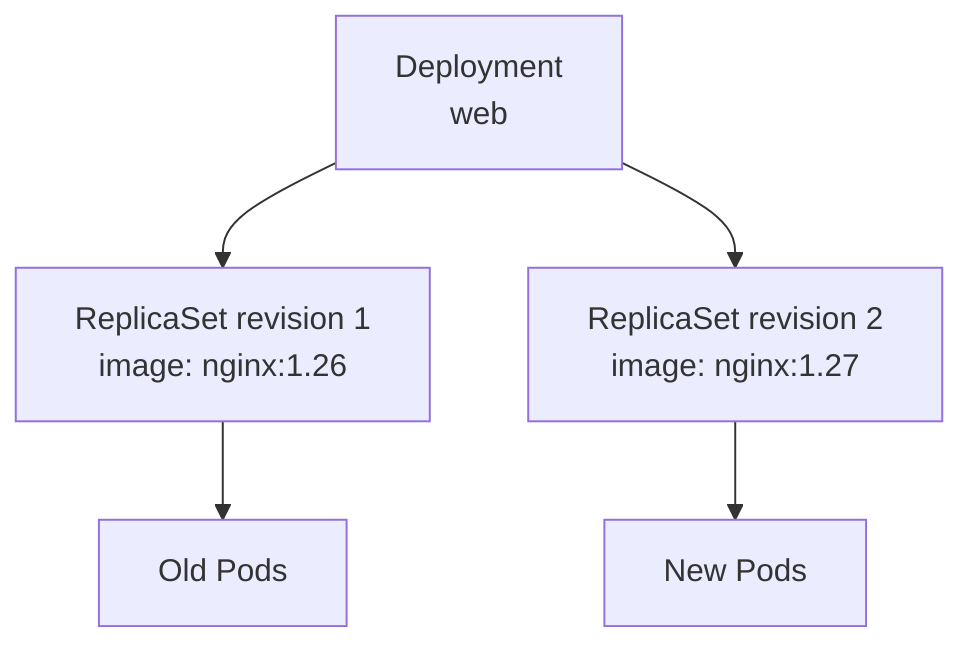
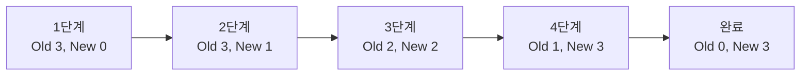
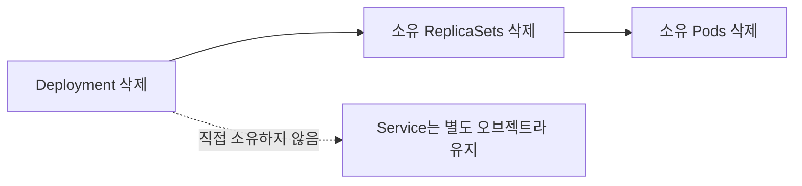

# 4. Deployment: ReplicaSet과 Pod의 배포 관리

Deployment는 stateless 애플리케이션의 배포 상태를 선언하고 ReplicaSet과 Pod의 생성, 확장, 업데이트와 rollback을 관리하는 상위 controller이다.



사용자는 Deployment를 관리하고 Deployment controller가 ReplicaSet을, ReplicaSet controller가 Pod를 관리한다.

## Deployment를 사용하는 이유

ReplicaSet은 지정한 수의 Pod를 유지하지만 template 변경을 안전한 배포 과정으로 관리하지 않는다. 운영 환경에서 ReplicaSet을 직접 정의하는 경우가 드문 이유이다.

Deployment는 다음 문제를 해결한다.

- 원하는 replica 수 유지
- container image와 Pod template의 선언적 변경
- Rolling Update 또는 Recreate 전략 선택
- 배포 진행 상태와 실패 조건 확인
- revision history를 이용한 rollback
- scale, pause와 resume

```text
ReplicaSet: 같은 형태의 Pod를 몇 개 유지할 것인가?
Deployment: 어떤 version의 Pod를 어떤 전략으로 배포할 것인가?
```

## Deployment YAML 구조

```yaml
apiVersion: apps/v1
kind: Deployment
metadata:
  name: web
  labels:
    app: web
spec:
  replicas: 3
  selector:
    matchLabels:
      app: web
  strategy:
    type: RollingUpdate
    rollingUpdate:
      maxSurge: 1
      maxUnavailable: 0
  template:
    metadata:
      labels:
        app: web
    spec:
      containers:
        - name: nginx
          image: nginx:1.27
          ports:
            - name: http
              containerPort: 80
          readinessProbe:
            httpGet:
              path: /
              port: http
            initialDelaySeconds: 2
            periodSeconds: 5
```

ReplicaSet과 마찬가지로 다음 관계가 중요하다.

```text
spec.selector.matchLabels == spec.template.metadata.labels
```

Deployment를 만든 뒤에는 `spec.selector`를 변경할 수 없으므로 애플리케이션을 구별할 label을 처음부터 신중히 정한다.

`readinessProbe`는 새 Pod가 실제 요청을 받을 준비가 되었는지 판단한다. Rolling Update가 안전하려면 process 실행 여부만이 아니라 준비 상태를 정확히 표현해야 한다.

## Deployment 사용하기

```bash
kubectl apply -f web-deployment.yaml
kubectl get deployments
kubectl get replicasets
kubectl get pods -l app=web
kubectl rollout status deployment/web
```

`kubectl apply`가 오브젝트를 받았더라도 rollout 완료까지 시간이 걸릴 수 있다. 자동화에서는 `kubectl rollout status` 결과까지 확인한다.

### kubectl describe로 보는 정보

```bash
kubectl describe deployment web
```

주요 확인 항목:

- `Replicas`: desired, updated, total, available, unavailable
- `StrategyType`: RollingUpdate 또는 Recreate
- `RollingUpdateStrategy`: maxUnavailable, maxSurge
- `Pod Template`: image, port, probe, resource 설정
- `Conditions`: Available, Progressing과 reason
- `OldReplicaSets`, `NewReplicaSet`
- `Events`: scale up·down 기록과 실패 원인

Deployment가 Pod를 직접 만들었다고 생각하기보다 Events에서 새 ReplicaSet 생성과 각 ReplicaSet의 scale 변화를 따라가면 구조가 잘 보인다.

## Rolling Update

`RollingUpdate`는 기본 전략이다. Deployment controller는 새 template을 사용하는 ReplicaSet을 만들고 새 Pod를 늘리면서 이전 ReplicaSet의 Pod를 줄인다.



실제 순서와 순간 Pod 수는 `maxSurge`, `maxUnavailable`, readiness 결과와 종료 시간에 따라 달라진다.

### maxSurge

원하는 replica 수보다 추가로 만들 수 있는 최대 Pod 수이다. 숫자 또는 비율을 사용한다.

```yaml
rollingUpdate:
  maxSurge: 1
```

`replicas: 3`, `maxSurge: 1`이면 update 중 최대 4개의 Pod를 실행할 수 있다. 추가 자원이 필요하지만 새 Pod를 먼저 준비하기 쉽다.

### maxUnavailable

update 중 사용할 수 없어도 되는 최대 Pod 수이다.

```yaml
rollingUpdate:
  maxUnavailable: 0
```

0이면 원하는 3개가 available 상태를 유지한 뒤 이전 Pod를 줄이는 방향으로 동작한다. 다만 `maxSurge: 0`과 `maxUnavailable: 0`을 동시에 사용할 수는 없다.

### Recreate

```yaml
strategy:
  type: Recreate
```

새 revision을 만들 때 이전 revision의 Pod를 모두 종료한 후 새 Pod를 만든다. update 과정에 중단이 발생할 수 있지만 구 version과 신 version을 동시에 실행할 수 없는 애플리케이션에서 고려한다.

## Image 업데이트

학습 중 빠르게 rollout을 만들려면 다음 명령을 사용할 수 있다.

```bash
kubectl set image deployment/web nginx=nginx:1.28
kubectl rollout status deployment/web
```

운영에서 YAML이나 Git이 원하는 상태의 원본이라면 Manifest의 image도 함께 변경해야 한다.

```yaml
containers:
  - name: nginx
    image: nginx:1.28
```

고정되지 않은 `latest` tag보다 변경한 version이 드러나는 tag 또는 image digest를 사용하면 revision과 실제 artifact의 관계를 추적하기 쉽다.

## 배포 상태 확인과 Rollback

### Rollout 상태

```bash
kubectl rollout status deployment/web
kubectl get deployment web
kubectl describe deployment web
kubectl get rs
kubectl get pods -l app=web
```

새 Pod가 Ready가 되지 않으면 다음을 이어서 확인한다.

```bash
kubectl describe pod <NEW_POD_NAME>
kubectl logs <NEW_POD_NAME> -c nginx
```

`progressDeadlineSeconds`가 지나면 Deployment condition에 `ProgressDeadlineExceeded`가 표시될 수 있지만 Kubernetes가 자동으로 rollback하는 것은 아니다. 원인을 해결하거나 사용자가 rollback해야 한다.

### Revision history

```bash
kubectl rollout history deployment/web
kubectl rollout history deployment/web --revision=2
```

변경 이유를 history에 남기려면 `metadata.annotations.kubernetes.io/change-cause`를 Manifest에 기록할 수 있다.

### Rollback

바로 이전 revision으로 되돌린다.

```bash
kubectl rollout undo deployment/web
```

특정 revision으로 되돌릴 수도 있다.

```bash
kubectl rollout undo deployment/web --to-revision=2
kubectl rollout status deployment/web
```

Rollback도 과거 ReplicaSet의 Pod template을 다시 배포하는 새로운 조정 과정이다. database schema처럼 애플리케이션 밖의 변경까지 자동으로 되돌리지는 않는다.

## Pause와 Resume

여러 template 변경을 하나의 rollout으로 모으고 싶다면 Deployment를 잠시 중지할 수 있다.

```bash
kubectl rollout pause deployment/web
kubectl set image deployment/web nginx=nginx:1.28
kubectl rollout resume deployment/web
kubectl rollout status deployment/web
```

pause 상태에서도 replica 수 조절은 가능하지만 새 revision rollout은 시작되지 않는다. 변경을 마친 뒤 resume을 잊지 않는다.

## 리소스 정리

```bash
kubectl delete -f web-deployment.yaml
```

Deployment를 삭제하면 ownerReferences와 garbage collection에 따라 소유한 ReplicaSet과 Pod도 기본적으로 삭제된다.



같은 label을 선택하는 Service는 Deployment가 소유하지 않으므로 함께 삭제되지 않는다. 실습을 완전히 정리하려면 Service Manifest도 별도로 삭제한다.

```bash
kubectl delete -f web-service.yaml
```

Namespace 전체를 삭제하면 내부 리소스도 함께 삭제되므로 실습 전용 namespace를 사용하면 정리가 편하다. 단, namespace 삭제는 범위가 넓으므로 대상 이름을 반드시 확인한다.

## 참고

- [Deployments](https://kubernetes.io/docs/concepts/workloads/controllers/deployment/)
- [Run a Stateless Application Using a Deployment](https://kubernetes.io/docs/tasks/run-application/run-stateless-application-deployment/)
- [Update a Deployment Without Downtime](https://kubernetes.io/docs/tutorials/kubernetes-basics/update/update-intro/)
- [Probes](https://kubernetes.io/docs/concepts/configuration/liveness-readiness-startup-probes/)
