# 5. Service: Pod 연결과 외부 노출

Pod는 생성과 삭제를 반복하며 이름과 IP가 바뀐다. ReplicaSet이나 Deployment가 같은 역할의 Pod를 다시 만들더라도 새 Pod는 이전 Pod의 IP를 이어받지 않는다.

Service는 label selector와 일치하는 Pod 집합 앞에 안정적인 virtual IP와 DNS 이름을 제공한다. Client는 개별 Pod를 찾지 않고 Service로 요청하고, Service data plane이 준비된 backend endpoint로 트래픽을 전달한다.

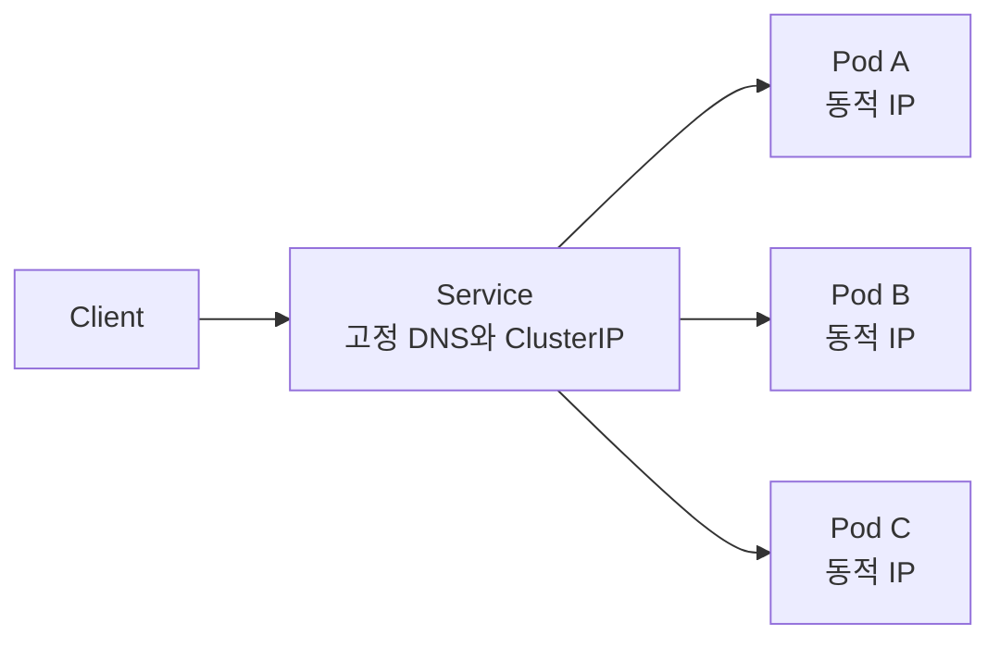

## Service가 필요한 이유

Service는 다음 세 역할을 중심으로 이해한다.

### 안정적인 발견 주소

Service에는 수명 동안 유지되는 ClusterIP와 DNS 이름이 생긴다. 같은 namespace의 client는 보통 Service 이름만으로 접근한다.

```text
http://web
http://web.default
http://web.default.svc.cluster.local
```

### 여러 Pod로 요청 분산

Service selector와 일치하고 Ready인 Pod들이 EndpointSlice에 backend로 등록된다. 트래픽은 사용 중인 kube-proxy 또는 대체 data plane 구현에 따라 endpoint 중 하나로 전달된다.

Service의 분산 기능은 L4 TCP·UDP·SCTP 연결 단위에 가깝다. HTTP path나 host 기반 L7 routing이 필요하면 Ingress 또는 Gateway API와 해당 controller를 사용한다.

### 내부 또는 외부 노출

Service `type`에 따라 클러스터 내부 전용 주소, 각 node의 port, cloud Load Balancer 또는 외부 DNS 별칭을 제공할 수 있다.

Docker에서는 host port publishing으로 한 host의 container를 노출하는 경우가 많다. Kubernetes에서는 Pod가 여러 node에 분산되고 교체되므로 Service와 selector를 통해 동적인 backend 집합을 노출한다.

## Service 종류

| type | 접근 범위 | 주요 용도 | 핵심 주소 |
| --- | --- | --- | --- |
| `ClusterIP` | 클러스터 내부 | 내부 API, database 접근점 | Service DNS, ClusterIP |
| `NodePort` | node network에서 접근 가능 | 학습, 외부 Load Balancer의 backend | `<NodeIP>:<NodePort>` |
| `LoadBalancer` | 구현이 제공하는 외부·내부 network | cloud 또는 LB controller 연동 | external IP·hostname |
| `ExternalName` | DNS 조회 가능한 client | 외부 DNS 이름에 내부 별칭 제공 | CNAME |

`NodePort`는 ClusterIP 기능 위에 node port를 추가하고, 일반적인 `LoadBalancer` 구현은 그 위에 외부 Load Balancer를 추가한다. 다만 일부 Load Balancer 구현은 node port를 거치지 않고 Pod로 직접 전달할 수 있다.

## ClusterIP

`ClusterIP`는 기본 Service type이다. 클러스터 내부에서만 사용하는 virtual IP를 할당한다.

다음 Deployment가 `app: web` label을 가진 Pod를 실행한다고 가정한다.

```yaml
apiVersion: apps/v1
kind: Deployment
metadata:
  name: web
spec:
  replicas: 3
  selector:
    matchLabels:
      app: web
  template:
    metadata:
      labels:
        app: web
    spec:
      containers:
        - name: nginx
          image: nginx:1.27
          ports:
            - name: http
              containerPort: 80
```

Service Manifest:

```yaml
apiVersion: v1
kind: Service
metadata:
  name: web
spec:
  type: ClusterIP
  selector:
    app: web
  ports:
    - name: http
      protocol: TCP
      port: 80
      targetPort: http
```

### 핵심 필드

#### spec.selector

Service가 backend로 사용할 Pod를 label로 선택한다.

```yaml
selector:
  app: web
```

Deployment의 `spec.template.metadata.labels`와 일치해야 한다. Service 자체의 `metadata.labels`는 backend 선택에 사용되지 않는다.

#### spec.ports.port

Client가 Service에 접근할 port이다.

```yaml
ports:
  - port: 80
```

#### spec.ports.targetPort

Service가 선택한 Pod에서 실제로 요청을 전달할 port이다. 숫자 또는 Pod container port의 이름을 사용할 수 있다.

```yaml
targetPort: http
```

이 예제의 흐름은 다음과 같다.

```text
web:80 -> PodIP:80
```

`targetPort`를 생략하면 기본적으로 `port`와 같은 값을 사용한다. 이름을 사용하면 container port 번호를 변경할 때 Service와 Pod 사이의 계약을 더 명확히 유지할 수 있다.

#### spec.type

생략하면 기본값은 `ClusterIP`이다. 학습 문서에서는 의도를 명확히 보여주기 위해 직접 작성했다.

### 내부 DNS와 트래픽 흐름

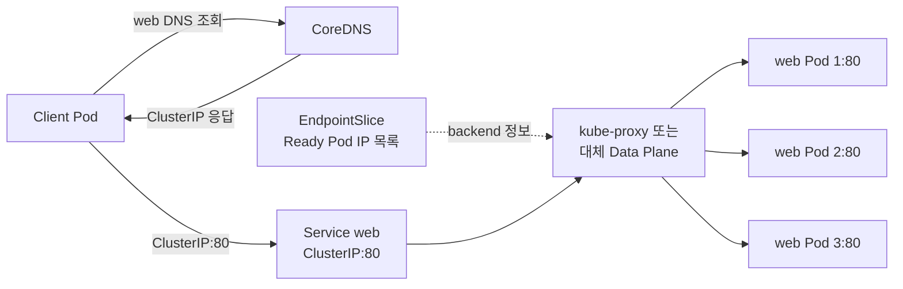

Service virtual IP는 일반적으로 특정 network interface에 직접 묶인 일반 서버 IP가 아니다. 각 node의 data plane이 ClusterIP로 향하는 packet을 선택된 endpoint로 전달하도록 규칙을 구성한다.

### 적용과 확인

```bash
kubectl apply -f web-deployment.yaml
kubectl apply -f web-service.yaml
kubectl get services
kubectl get service web -o wide
kubectl describe service web
```

임시 Pod에서 DNS와 HTTP 연결을 확인할 수 있다.

```bash
kubectl run curl --rm -it --restart=Never \
  --image=curlimages/curl:8.10.1 -- \
  curl http://web
```

Image tag는 실습 시점에 존재하는 version으로 조정한다.

## EndpointSlice

EndpointSlice는 Service가 실제로 전달할 network endpoint를 담는 API 오브젝트이다. Selector가 있는 Service를 만들면 control plane이 일치하는 Pod를 찾아 EndpointSlice를 자동으로 관리한다.

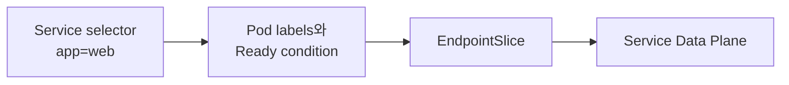

확인 명령:

```bash
kubectl get endpointslices
kubectl get endpointslices \
  -l kubernetes.io/service-name=web \
  -o wide
```

Service에 ClusterIP가 있지만 요청이 연결되지 않는다면 다음 순서로 확인한다.

1. Service selector와 Pod label이 일치하는가?
2. Pod가 `Ready` 상태인가?
3. EndpointSlice에 Pod IP와 올바른 target port가 들어 있는가?
4. 애플리케이션이 해당 port에서 실제로 listen하는가?

```bash
kubectl get service web -o yaml
kubectl get pods -l app=web --show-labels
kubectl get endpointslices -l kubernetes.io/service-name=web -o yaml
kubectl describe pod <POD_NAME>
```

Endpoints는 이전부터 사용된 API이지만 현재 Service backend 확장과 전달 정보의 중심은 EndpointSlice이다.

## NodePort

NodePort Service는 ClusterIP에 더해 모든 대상 node IP의 정해진 port로 Service에 접근할 수 있게 한다.

```yaml
apiVersion: v1
kind: Service
metadata:
  name: web-nodeport
spec:
  type: NodePort
  selector:
    app: web
  ports:
    - name: http
      protocol: TCP
      port: 80
      targetPort: http
      nodePort: 30080
```

기본 NodePort 범위는 `30000-32767`이다. `nodePort`를 생략하면 control plane이 사용 가능한 값을 할당한다. 직접 지정하면 충돌하지 않는지 사용자가 관리해야 한다.

```text
<NodeIP>:30080 -> Service -> Ready web Pod:80
```

### 외부와 내부 트래픽 흐름

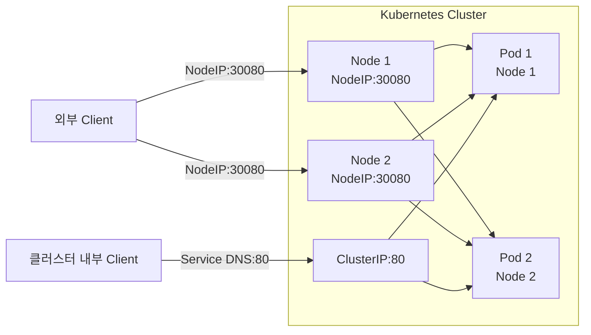

기본 `externalTrafficPolicy: Cluster`에서는 요청을 받은 node에 local Pod가 없어도 다른 node의 endpoint로 전달할 수 있다.

NodePort는 Docker Swarm의 routing mesh처럼 어느 node로 접근해도 backend로 전달될 수 있다는 점이 비슷하다. 그러나 구현 구조, Service discovery와 network model이 같다는 뜻은 아니다.

### NodePort 확인

```bash
kubectl get service web-nodeport
kubectl describe service web-nodeport
kubectl get nodes -o wide
```

Client가 node network에 접근할 수 있고 firewall이 NodePort를 허용해야 한다.

```bash
curl http://<NODE_IP>:30080
```

개별 node IP와 높은 port를 직접 노출하므로 일반적인 production 공개 endpoint로는 외부 Load Balancer나 Ingress·Gateway 앞단을 사용한다.

## LoadBalancer와 MetalLB

### Cloud LoadBalancer

Cloud provider integration이나 별도의 Load Balancer controller가 있는 클러스터에서 `type: LoadBalancer`를 만들면 외부 또는 내부 Load Balancer를 요청한다.

```yaml
apiVersion: v1
kind: Service
metadata:
  name: web-lb
spec:
  type: LoadBalancer
  selector:
    app: web
  ports:
    - name: http
      port: 80
      targetPort: http
```

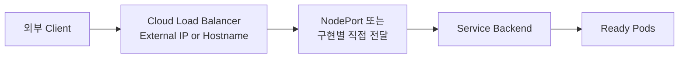

Load Balancer 생성은 Kubernetes core가 직접 수행하는 것이 아니다. Cloud Controller Manager 또는 설치한 controller가 Service를 관찰하고 provider API와 연동한다. 지원 구현이 없는 로컬·bare metal cluster에서는 `EXTERNAL-IP`가 계속 `pending`일 수 있다.

이 학습 단계에서는 실제 cloud 자원을 만들기보다 다음 구조만 이해한다.

```text
LoadBalancer Service
  = 안정적인 외부 주소 요청
  + Service backend 연결
  + provider 또는 controller가 구현하는 Load Balancer
```

### 온프레미스와 MetalLB

Bare metal에는 cloud provider가 외부 Load Balancer를 자동 생성하지 않는다. MetalLB 같은 controller를 설치하면 사용자가 준비한 address pool에서 Service IP를 할당하고 그 IP가 cluster에 있다는 사실을 외부 network에 알릴 수 있다.

MetalLB의 대표 광고 방식:

- Layer 2 mode: 한 node가 Service IP를 소유한 것처럼 IPv4에서는 ARP, IPv6에서는 NDP로 알린다.
- BGP mode: cluster node가 router와 BGP peering을 맺고 Service IP route를 광고한다.

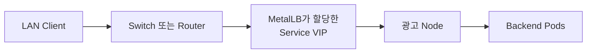

MetalLB 설치만으로 network 설계가 끝나는 것은 아니다. 사용할 IP 범위가 DHCP와 겹치지 않는지, L2 reachability 또는 BGP router 설정, 장애 시 광고 전환과 `externalTrafficPolicy`를 함께 검토해야 한다.

## externalTrafficPolicy

`externalTrafficPolicy`는 NodePort와 LoadBalancer로 들어오는 외부 트래픽을 cluster 전체 endpoint로 보낼지, 요청을 받은 node의 local endpoint로만 보낼지를 정한다.

### Cluster

기본값이다.

```yaml
spec:
  externalTrafficPolicy: Cluster
```

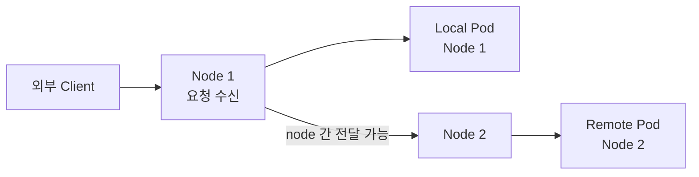

특징:

- 요청을 받은 node에 local endpoint가 없어도 다른 node의 Pod로 전달 가능
- 전체 endpoint를 활용하므로 분산이 상대적으로 균일
- 경로에 따라 client source IP가 SNAT되어 애플리케이션에 node IP로 보일 수 있음
- remote endpoint 선택 시 node 간 network hop이 추가될 수 있음

### Local

```yaml
spec:
  externalTrafficPolicy: Local
```

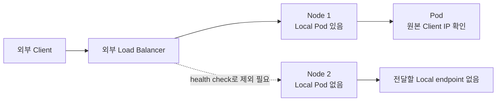

특징:

- 요청을 받은 node의 local endpoint로만 전달
- 일반적인 동작에서 원본 client source IP 보존 가능
- 불필요한 node 간 hop 감소
- local endpoint가 없는 node로 직접 보낸 NodePort 트래픽은 전달되지 않음
- Load Balancer가 local endpoint가 있는 node만 선택하도록 health check 연동 필요

### Local에서 생길 수 있는 불균형

외부 Load Balancer가 node 단위로 요청을 균등 분산하더라도 node마다 Pod 개수가 다르면 Pod 단위 부하는 불균형해질 수 있다.

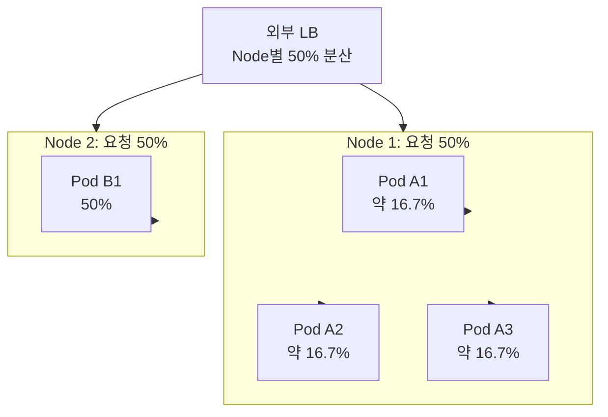

`Local`을 선택할 때는 source IP 보존뿐 아니라 Pod topology spread, DaemonSet 여부, Load Balancer algorithm과 health check를 함께 고려한다.

| 기준 | `Cluster` | `Local` |
| --- | --- | --- |
| endpoint 범위 | cluster 전체 | 요청 수신 node의 local endpoint |
| source IP | 경로에 따라 SNAT 가능 | 일반적으로 보존 |
| node 간 hop | 발생 가능 | 없음 |
| endpoint 없는 node | remote Pod로 전달 가능 | 트래픽 전달 불가 |
| Pod별 부하 | 비교적 전체 분산 | node별 Pod 수에 따라 불균형 가능 |

## ExternalName

ExternalName Service는 selector와 virtual IP를 사용해 packet을 전달하지 않는다. 클러스터 내부 Service 이름을 외부 DNS 이름에 연결하는 CNAME 별칭을 만든다.

```yaml
apiVersion: v1
kind: Service
metadata:
  name: external-database
spec:
  type: ExternalName
  externalName: db.example.com
```

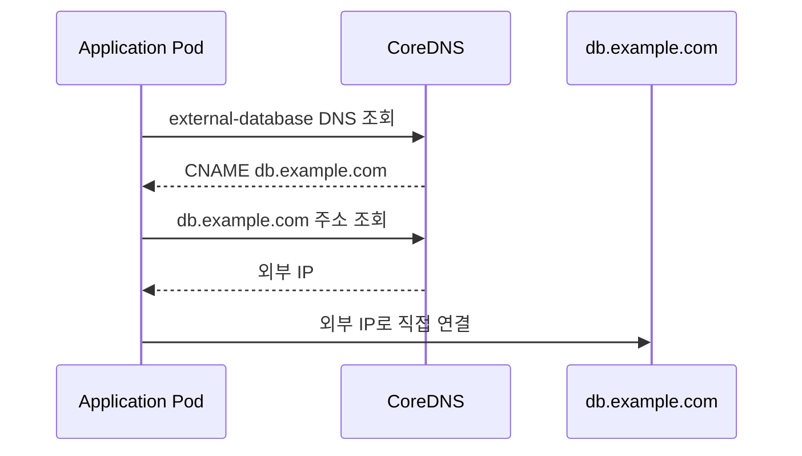

즉, Service가 요청을 proxy하거나 redirect하는 것이 아니라 DNS 응답으로 다른 이름을 알려 준다.

장점:

- 애플리케이션은 cluster 내부 이름만 사용
- 외부 database나 API 주소를 한 Service 이름 뒤에 감춤
- 나중에 대상 주소를 바꿀 때 client 설정 변경 범위를 줄임

주의점:

- `spec.externalName`에는 DNS 이름을 사용한다. IP 주소 mapping 용도가 아니다.
- port forwarding과 load balancing을 제공하지 않는다.
- HTTP `Host` header 또는 TLS 인증서 이름은 client가 사용한 Service 이름과 외부 hostname이 달라 문제가 생길 수 있다.
- DNS TTL과 cache 때문에 변경이 모든 client에 즉시 반영된다고 가정하지 않는다.

## Service 문제 해결 순서

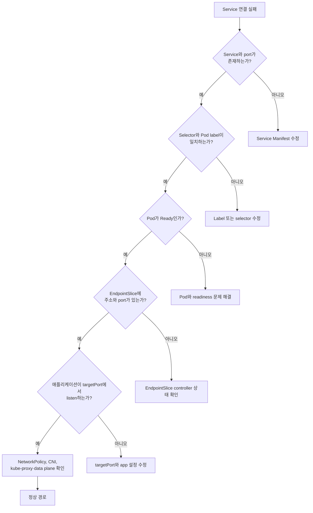

기본 명령:

```bash
kubectl get services
kubectl describe service web
kubectl get pods -l app=web -o wide
kubectl get endpointslices -l kubernetes.io/service-name=web
kubectl describe pod <POD_NAME>
```

## 리소스 정리

```bash
kubectl delete -f web-service.yaml
kubectl delete -f web-deployment.yaml
```

Service를 삭제해도 선택된 Pod는 삭제되지 않는다. Selector는 소유 관계가 아니기 때문이다. 반대로 Deployment를 삭제해도 Service는 남으므로 실습 리소스를 각각 정리한다.

## 참고

- [Service](https://kubernetes.io/docs/concepts/services-networking/service/)
- [EndpointSlices](https://kubernetes.io/docs/concepts/services-networking/endpoint-slices/)
- [DNS for Services and Pods](https://kubernetes.io/docs/concepts/services-networking/dns-pod-service/)
- [Using Source IP](https://kubernetes.io/docs/tutorials/services/source-ip/)
- [MetalLB Concepts](https://metallb.io/concepts/)
